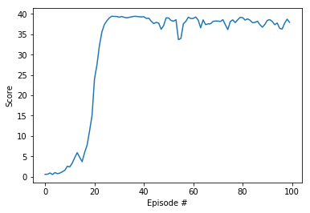

# Project 2: Continuous Control

In this project, we exploit DDPG to continuously control a double-jointed arm.
A reward of +0.1 is provided for each step if the agent's hand is in the goal location. Thus, the goal of the agent is to maintain its position at the target location for as many time steps as possible.
The observation space consists of 33 variables corresponding to position, rotation, velocity, and angular velocities of the arm. Each action is a vector with four numbers, corresponding to torque applicable to two joints. Every entry in the action vector should be a number between -1 and 1.

## Methods
Deep Deterministic Policy Gradient (DDPG) is closely connected to Q-learning and specifically adapted for environments with continuous action spaces. 
In DDPG, an actor `μ(s)` is used to propose the optimal action under a given state, and a critic `Q(s, a)` evaluates the state-action pair to approximate optimal Q value.
Thus DDPG concurrently learns a Q-function and a policy using off-policy data.
 
In DDPG, we train the critic by minimizing the temporal difference (TD) error δ:

and train the actor by maximizing expected Q values:

## Results
We solve the task in 100 episodes. A plot of score (the average reward over 100 episodes) is included below. 

    

## Future Work
I am interested in the following two directions for future improvements

- Research and compare several policy-based methods, such as PPO, TD3, SAC. It would be interesting to know the performance gaps and advantages of these methods.

- Research effective ways of building models and tuning parameters. 
It seems that policy-based methods (and deep reinforcement learning) are much more sensitive to initialization, normalization and tuning compared to supervised learning.
