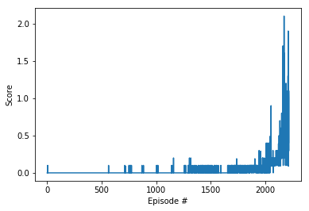

# Project 3: Collaboration and Competition

In this project, we exploit [Multi-Agent Deep Deterministic Policy Gradient (MADDPG)](https://arxiv.org/abs/1706.02275) to control two rackets to bounce a ball over a net.
If an agent hits the ball over the net, it receives a reward of +0.1. If an agent lets a ball hit the ground or hits the ball out of bounds, it receives a reward of -0.01. Thus, the goal of each agent is to keep the ball in play.
The observation space consists of 8 variables corresponding to the position and velocity of the ball and racket. Each agent receives its own, local observation. Two continuous actions are available, corresponding to movement toward (or away from) the net, and jumping.

## Methods
MADDPG is an extension of DDPG for Multi-Agent Reinforcement Learning, which uses separate actor and critic for each agent and a shared memory buffer. 
The common experience replay buffer contains tuples of states, actions, rewards, next states and terminal signals collected from all agents.
While each agent is trained separately by its own sampling from this shared replay buffer. The agents learn to collaborate and compete through training.
We implement MADDPG by adapting DDPG implemented in project 2 to a multi-agent environment.

## Models and Hyperparameters
Both actors and critics are three-layer fully connected networks, with RELU as activation function. The hyperparameters used in training are as follows

| Hyperparameter                      | Value |
| ----------------------------------- | ----- |
| BUFFER_SIZE                         | 1e5   |
| BATCH_SIZE                          | 128   |
| GAMMA                               | 0.99  |
| TAU                                 | 1e-3  |
| LR_Actor                            | 1e-4  |
| LR_CRITIC                           | 1e-4  |

## Results
We solve the task in 2219 episodes. A plot of score (the average reward over 100 episodes) is included below. 

    

## Future Work
I am interested in the following two directions for future improvements

- Research and compare other MADDPG methods, especially a shared critic.

- Research effective ways of stabilizing multi-agent systems. The scores in multi-agent tasks are much more noisy, as shown in the plot of score.